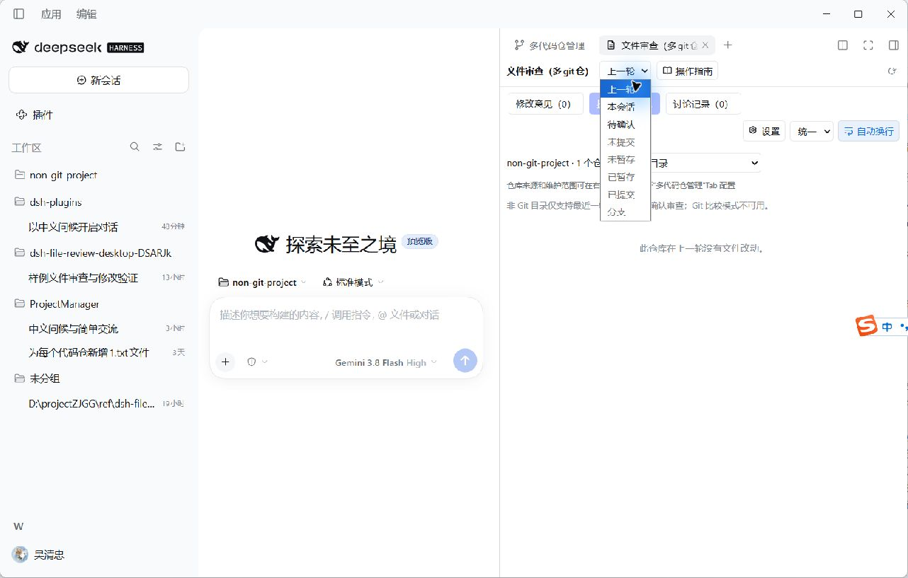
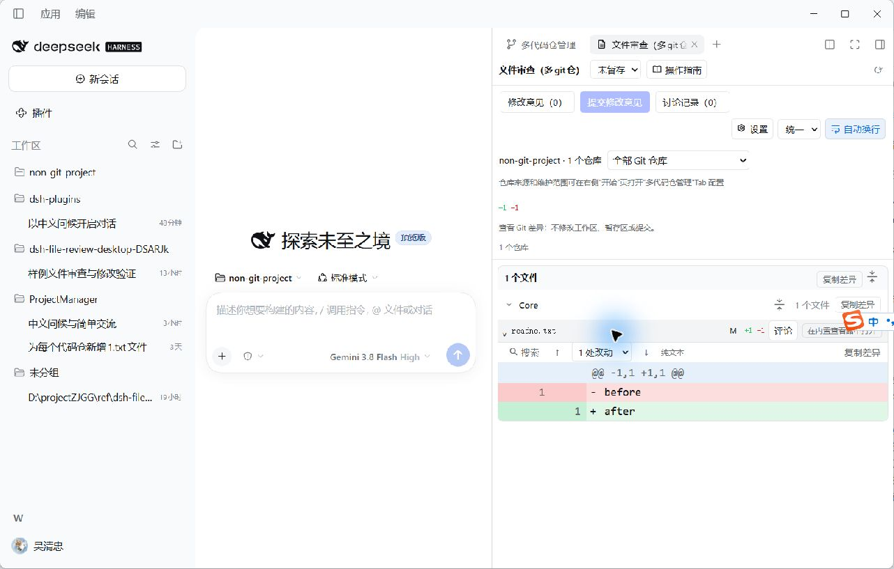

# 非 Git 目录实施与验证记录

日期：2026-10-05。管理插件 **0.1.2**，审查插件 **0.3.2**，审查消费者精确依赖管理插件 0.1.2。两个版本均比此前增加 0.0.1。本次为本地交付，未发布远程版本。

公共配置、目标分类、发现及文件归属放在管理插件；审查插件只保留会话审查、Git 比较和确认业务。模块入口分别见管理插件的 `docs/MANAGED_TARGETS.md` 与本仓库的 [目录审查说明](NON_GIT_DIRECTORIES.md)。

## 自动检查

| 检查 | 结果与覆盖范围 |
| --- | --- |
| 双插件类型检查与构建 | 通过；先构建管理插件，再构建消费者 |
| 管理插件 Node 测试 | 49 / 49；包含目录分类、v1/v2 迁移与备份、冲突保存、发现边界、链接及临时目标隔离 |
| 审查插件 Node 测试 | 172 / 172；包含真实 Git 父仓中的普通目录、归属拒绝、撤销／重做、Git 排除和按文件确认迁移 |
| 浏览器测试 | 8 / 8；加载实际双客户端 bundle，覆盖中英文、汇总／单目录、Git 模式限制、隐藏文件确认隔离、发现保存、窄栏与草稿 |
| 文档检查 | 通过；中英文操作指南及既有 18 张手册图完整 |
| 两个包的 exports 与内容检查 | 通过；归档中 Host、Client 与构建字节一致，临时方案不进入包 |
| 实际 tgz 隔离联装 | 通过；精确版本依赖和单一 Cordis 公共服务可用 |

## 指定 Desktop 的实际验证

实际程序为 `D:\app\DeepSeekHarnessDesktop\DeepSeek Harness.exe`，宿主包版本 `@deepseek-ai/dsh-desktop@0.2.0-rc.2`，平台 Windows。安装前备份 desktop Profile 的 package、lockfile、workspace 和 Cordis 配置；只替换两个插件的本地包引用，保留其他插件和 bundles 顺序。已安装两个插件的 Host／Client SHA256 与当前构建一致。

实际 UI 使用隔离工程 `.desktop-migration-test/non-git-project`，未向模型发送新消息。工程包含一个独立 Git 仓库 `core`、普通目录 `project/LocalComponent` 和 `project/plugins/LocalPlugin`。开始时项目文件为 v1，关闭工程根纳管，只配置 `Core`。

| 实际操作 | 观察结果 |
| --- | --- |
| 右侧开始页与原生 Tab | “多代码仓管理”和“文件审查（多git仓）”均正常打开，管理没有左侧会话页签 |
| 填入 `project` 与 `project/plugins`，预览发现 | 返回两个普通目录；嵌套容器 `project/plugins` 本身没有成为候选目标 |
| 逐项添加两个候选并保存 | 写入 v2；Git 条目、普通目录、发现容器分别保存为工程内相对路径 |
| 首次 v1 → v2 | 生成 `dsh-file-review-repositories.json.v1.bak`；保留原 v1 配置，备份 SHA256 为 `428f0e5fab8ec1e4783806266648fc77c7d9a0848f2fdd6488114eff61068f7e` |
| 选择“非 Git 目录” | 汇总与两个单目录选项可见；只保留会话三种审查模式，五种 Git 比较模式禁用 |
| 切回全部 Git 并选择“未暂存” | 仅显示 `Core/readme.txt`，展开真实 `before` → `after` 差异成功 |
| 应用菜单正常退出，再从指定路径启动 | 管理和审查原生 Tab 恢复；重新加载显示 Git 1、普通目录 2、不可用 0，名称、类型、相对路径及发现容器保持正确 |
| 原 ProjectManager 只读核对 | 原 17 个路径均是各自独立 Git 根；父仓仍忽略 `project/PluginManager`；原 JSON 保持 v1，没有添加目录或修改真实工程源码 |

## 验证边界

实际 Desktop 没有生成新的 Git／普通目录混合工具轮次，也没有发送评论或消息。因此混合轮次的范围确认、深链、复制、归属阻断与普通目录撤销／重做由上述自动测试覆盖，不能解释为本轮全部完成了真实宿主人工操作。外部普通目录的多会话隔离及释放、损坏 Git 和类型变化诊断同样由管理及 Host 自动测试覆盖。真实 UI 完成的是发现、迁移、保存、审查模式限制、Git 差异加载和正常退出重启。

隔离工程与 Profile 备份保留在 `.desktop-migration-test/`，便于复查；未删除既有备份。`D:\projectZJGG\ref\dsh-file-review` 未修改。没有修改 Desktop 的 app.asar 或生成生产会话消息。
