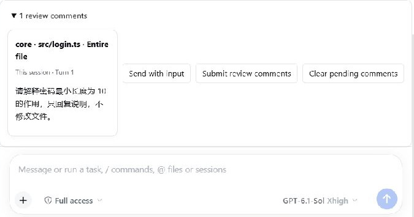
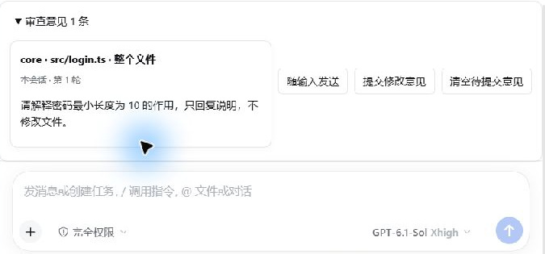
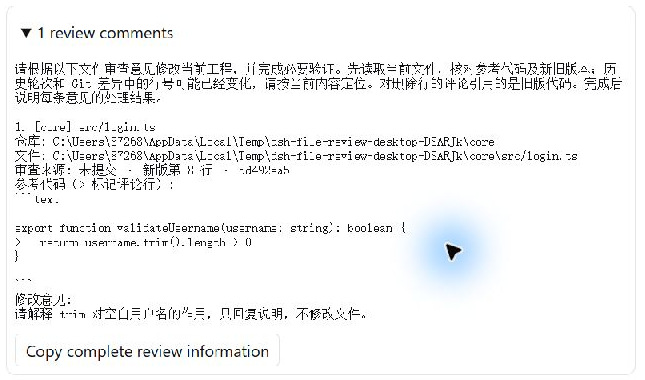
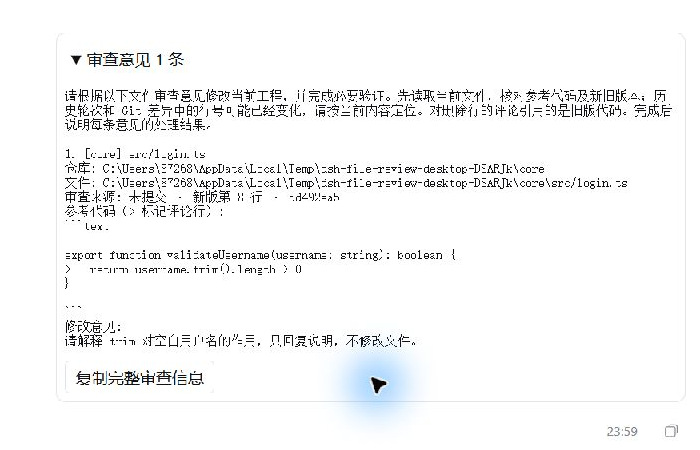
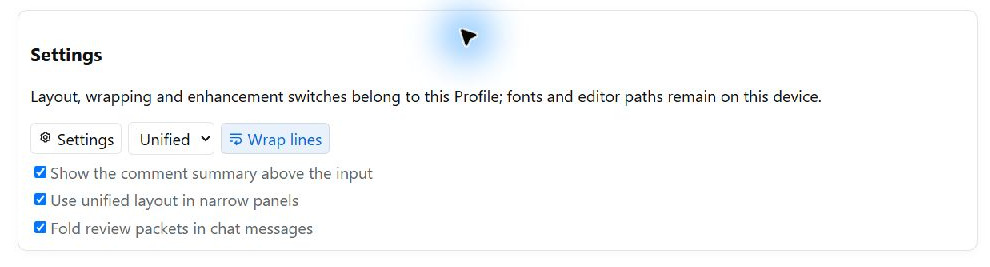

# File Review Plugin User Guide

The Multi-repository management tab in this guide is now provided by **dsh-multi-git-repo-manager v0.1.1**. Install and enable both the manager and file review plugins. Existing project files remain compatible and the editor workflow is unchanged. See [dependency notes](REPOSITORY_MANAGER.md).

[简体中文](USER_GUIDE.md) | [English](USER_GUIDE.en.md)

Applies to **dsh-file-review-tab-multi-git-repository v0.3.1**.

This guide explains the plugin's features, where to find them, how to use them, and what each action does. Instructions use the English interface labels. Choose English in the host's General settings to see those labels.

> All 18 screenshots were captured from the running Windows DeepSeek Harness Desktop 0.2.0-rc.2 with plugin v0.3.0 on 2026-10-04/05. They use two sample repositories, `core` and `cli`, in a separate temporary project; submissions and Agent replies come from actual interactions. Images are cropped to the relevant controls, excluding unrelated sessions, account details and input-method overlays. Some examples use Chinese labels; the paired enhancement images show both languages. Themes, widths and data may change the layout. Example replies are not built into the plugin.

## Contents

- [1. What the plugin does](#1-what-the-plugin-does)
- [2. First launch and quick start](#2-first-launch-and-quick-start)
- [3. Choosing a review scope](#3-choosing-a-review-scope)
- [4. Configuring multiple repositories](#4-configuring-multiple-repositories)
- [5. Reading diffs and expanding context](#5-reading-diffs-and-expanding-context)
- [6. Searching code and navigating changes](#6-searching-code-and-navigating-changes)
- [7. Selecting code and copying references](#7-selecting-code-and-copying-references)
- [8. Settings and appearance](#8-settings-and-appearance)
- [9. Navigating to code in an external editor](#9-navigating-to-code-in-an-external-editor)
- [10. Adding and submitting review comments](#10-adding-and-submitting-review-comments)
- [11. Reading and managing discussions](#11-reading-and-managing-discussions)
- [12. Confirming turns, undoing, and reapplying](#12-confirming-turns-undoing-and-reapplying)
- [13. Long sessions, large files, and special files](#13-long-sessions-large-files-and-special-files)
- [14. Language and saved data](#14-language-and-saved-data)
- [15. Troubleshooting](#15-troubleshooting)
- [16. Screenshot index](#16-screenshot-index)
- [17. Created files and trusted history](#17-created-files-and-trusted-history)
- [18. Input comment summary and folded messages](#18-input-comment-summary-and-folded-messages)
- [19. Profile settings and narrow layouts](#19-profile-settings-and-narrow-layouts)
- [20. Copy a turn or repository](#20-copy-a-turn-or-repository)

## 1. What the plugin does

The **File Review** tab brings together session code changes and Git diffs. You can review changes across repositories, reference specific lines, and submit feedback to the Agent in the current session.

| Feature | What you can do |
| --- | --- |
| Multiple Git repositories | Maintain repositories inside a project and temporarily add external repositories to the current session |
| Eight review scopes | Review the last turn, the whole session, pending turns, and working tree, index, commit, or branch changes |
| Diff reading | Switch between Unified and Split layouts, wrap lines, expand or collapse unchanged code, and expand multiple files |
| Search and navigation | Search recorded code in either version and jump to matches or changes |
| Basic syntax highlighting | Highlight C/C++, JavaScript, TypeScript, Python 3, JSON, and Markdown source |
| Code references | Select a line or a contiguous range and copy a code reference or path and line range |
| Editor navigation | Open files in the built-in viewer or navigate to after-version code in VS Code or Antigravity |
| Feedback and discussions | Add line, range, or whole-file comments, submit them together, read linked replies, and follow up |
| Turn management | Confirm reviewed turns and undo or reapply supported session changes |
| Reading settings | Configure context expansion, fonts, line height, colors, file shortcuts, and large-file virtualization |

Git scopes provide viewing and commenting without staging files, committing, or switching branches. Undo and reapply in session scopes change files on disk; check the target file or turn before using them.

## 2. First launch and quick start

### 2.1 Opening the plugin

1. Install and enable this plugin. This guide targets DeepSeek Harness Desktop **0.2.0-rc.2** and its native right sidebar; dsh-better-sidebar is optional.
2. After installation or an update, fully quit Desktop, including its tray process, and start it again. The plugin manager should show review **v0.3.1** and manager **v0.1.1**. See the [validation record](MIGRATION_VERIFICATION.md) for tested environments.
3. Open a session in the target project. Click **＋** at the top of the native right sidebar and choose **File Review (Multi-Git)** from the guide.
4. After the Agent finishes a turn that changes files, you can also click **Review** in the end-of-turn “Edited N files” row. Clicking an individual file name opens that file's changes.

See the [README installation instructions](../README.en.md#installation). Open **Multi-repository management** from the right sidebar’s **Start** page. It opens as a native tab, like File Review; the former conversation-header tab has been removed.

**Open this guide at any time:** click **User guide** beside the review-scope dropdown in the File Review header. The plugin dialog displays the manual with Markdown formatting and screenshots. Click a screenshot to enlarge it, then press Esc or click the close button to return. It displays `USER_GUIDE.en.md` when **Settings → General → Language** is English, or `USER_GUIDE.md` when it is Chinese. An open guide also follows language changes. Both manuals and the screenshots ship with the plugin, so you can open them from any project.

Press Esc in an enlarged image to close the image first; press Esc again to close the guide and return focus to its button. A guide tab restored from an older layout provides **User guide** and **Close legacy tab** buttons. New guides open as dialogs.

Use **Jump to chapter** at the top of the guide to go directly to a section. The host may display Markdown contents links as plain text; this selector provides navigation in the built-in guide.

Switching to another sidebar tab preserves expanded diffs, searches, selected lines, drafts and scrolling while pausing review polling. Closing the review tab releases its temporary page state; reopening starts a new page. Saved comments, discussions, confirmations and reading preferences keep their existing storage rules.

### 2.2 Trying the workflow with existing changes

1. Choose **Uncommitted** in the dropdown beside the File Review title.
2. Click the **Refresh status** icon at the top right to read Git changes saved on disk.
3. Expand a file under its repository. Use **Unified / Split** to change the layout.
4. Click an after-version line number to select code. For multiple lines, hold **Shift** and click another line number on the same side.
5. **Right-click** the selected code or line numbers and choose **Comment on selection**. Enter feedback and click **Comment** to save a draft.
6. Click **Review comments (N)** to check your drafts, then **Submit review comments** to send them to the current session's Agent.

To try commenting without asking for code changes, you can enter: “Please explain this code. Reply with an explanation only; do not modify files.” Submission sends a real message to the current session, so write feedback that matches your intent.


Figure 1: Review scope and reading controls appear above changes grouped by turn, repository, and file.

## 3. Choosing a review scope

The target selector separates All Git repositories, All non-Git directories, individual targets and Ownership unresolved. Ordinary directories support Last turn, This session and Pending review; the five Git modes are disabled and switching restores the previous session mode. Unmanaged historical files cannot be opened or changed. See [non-Git directory support](NON_GIT_DIRECTORIES.en.md).

Use the dropdown beside the File Review title to choose the changes you want to inspect.

| Scope | What it shows | When to use it |
| --- | --- | --- |
| Last turn | File changes produced by tools in the most recent turn | Check what the Agent just changed |
| This session | Recorded tool changes in the current session, grouped by turn | Review the session's editing history |
| Pending review | Tool changes in turns that have not been confirmed | Review turn by turn and hide checked turns |
| Uncommitted | HEAD compared with the working tree, including untracked files | Inspect all local changes before committing |
| Unstaged | Index compared with the working tree, including untracked files | Inspect changes not yet staged |
| Staged | HEAD compared with the index | Review what is staged for the next commit |
| Committed | A selected commit compared with its first parent | Review one commit; the initial commit uses an empty baseline |
| Branch | Current HEAD compared with the common ancestor of the selected branch | Review accumulated committed changes on the current branch |

**Last turn / This session / Pending review** use session tool records. Files you edit manually belong in **Uncommitted** or **Unstaged**. If the latest turn changed no files, Last turn is empty; use This session to inspect earlier tool changes.


Figure 2: **All repositories** groups Git changes across configured repositories. Selecting one repository restricts the list to it.

In **Committed / Branch**, selecting one repository also lets you choose its commit or baseline branch. The commit list contains the most recent 50 commits. With All repositories, each repository uses its own latest commit or default baseline branch. Branch comparisons exclude uncommitted changes. A repository with only its current branch reports that a comparison branch is needed; other repositories can still show results.

These scopes read Git status without changing the index, creating a commit, or checking out a branch.

## 4. Configuring multiple repositories

### 4.1 Adding and saving repositories inside a project

1. Open a session in the target project, then choose **Multi-repository management** from the native right sidebar's **Start** page. The former conversation tab has been removed. Older screenshots may show its previous position; configuration files and management operations remain compatible.
2. Check **Current project directory**. Relative repository paths use this directory as their base. The session determines the directory and project name; they cannot be changed on this page.
3. Select **Enable multi-repository management**. Keep **Also review files within the project root** selected if you want to review files at the project root as well.
4. Click **Add repository** and enter a name and path. For a project at `D:\demo\OrderProject`, two child repositories might use `core` and `cli`.
5. You can also click **Open** beside a row to choose an existing repository directory. This does not create or clone a repository.
6. On first use, click **Generate new configuration file**. For later changes, click **Save configuration**.
7. Scroll down to the recognition results. Each repository should be **Ready**, with a summary such as **2 / 2 Git repositories ready**. Return to File Review to use repository groups and filters.


Figure 3: The project repositories `core` and `cli` use relative paths. Their names label the review groups.

Configuration is stored in `dsh-file-review-repositories.json` at the project root. You can keep this file with the project or commit it to Git. Sessions opened at the project root or in a child directory discover the file automatically. Projects without a configuration file continue to use the original session directory for review.

### 4.2 External repositories and list maintenance

- External repositories use absolute paths, such as `D:\SharedRepos\CommonLibrary`, and show a **Temp** label. They apply only to the current session and are not written to the project configuration file.
- **Remove** asks whether to remove the repository from the list. It does not delete its directory. Save configuration to persist changes to the project list.
- If you edit the configuration file manually, click **Reload saved configuration** to read it again. Handle any unsaved list edits first.
- For **Missing path / Not a Git root**, check that you selected the repository root containing `.git`.
- An older repository list may be imported for migration. After the first save, the current project configuration file becomes authoritative.

Some Desktop builds need the [directory picker starting-path adapter](../README.en.md#desktop-directory-picker-starting-path-adapter). You can also type paths directly.

## 5. Reading diffs and expanding context

### 5.1 Expanding files and switching layouts

Click a file name or its arrow to expand or collapse the diff. Click a repository name or its arrow to hide or show that repository's file list.

The content expansion controls in turn or repository headings expand or collapse multiple files. The turn control applies to every repository in that turn; the repository control applies to files in that group. Git review's top control applies to the files currently listed by the filter. Hiding a repository list and collapsing file contents are separate actions.

- **Unified:** before- and after-version lines appear in one column, marked with `− / ＋`.
- **Split:** the before version appears on the left and the after version on the right.
- **Wrap lines:** long code lines wrap to the available width. This does not change the source or its line numbers.


Figure 4: The blue `@@ ... @@` bar identifies a change block. Expand context using the controls beside it.

### 5.2 Expanding and collapsing unchanged code

Diffs initially show 3 context lines around changes. The blue bars represent folded unchanged code.

1. **Expand in batches:** click the context control to reveal **N lines** at a time. N defaults to **20** and can be changed in Settings. If fewer lines remain, it reveals those lines.
2. **Expand all upward / downward:** click the double-arrow control with the corresponding tooltip. At the start or end, it expands to the boundary of the recorded version; between change blocks, it expands toward the neighboring block.
3. **Collapse this gap:** after expansion, the blue bar retains a collapse control. It collapses only that gap and leaves other expanded sections as they are.
4. **Reset all expanded context:** click **Collapse expanded context** in the file's diff toolbar.


Figure 5: The icon in the blue bar controls one gap. The toolbar action restores default context for the entire diff component.

Batch expansion in a middle gap divides N lines between its two ends. Git history comparisons use the selected versions. If a session record contains only partial text, the interface reports that the historical record does not contain the missing code; that section cannot be expanded.

**Copy diff** copies a compact diff with 3 context lines around each change, regardless of how much unchanged code you have expanded. To reference specific code, use the selection actions in section 7.

## 6. Searching code and navigating changes

### 6.1 Searching a file

1. Expand a file and click **Search** in its diff toolbar.
2. Enter literal text, such as `total`.
3. Choose **Both versions / Before / After**. Enable **Aa (Match case)** or **Whole word** as needed.
4. Check the match count and use the arrows beside the search field to navigate.
5. Click **×** in the search bar or press **Esc** to close it.


Figure 6: Matches are highlighted in the code. Split layout lets you compare both versions while searching.

Search includes recorded code that is currently folded. Navigating to a match expands nearby context. Missing historical text is not filled from current disk content. Search is literal and does not support regular expressions. Shared context counts once in Both versions, and results are limited to the first 10,000 matches.

### 6.2 Change navigation and shortcuts

Click **Previous change / Next change** in the diff toolbar, or choose a block in the change dropdown. Switching layout or language preserves search and navigation state.

| Default shortcut | Action | Where it applies |
| --- | --- | --- |
| Ctrl/Cmd + F | Open file search | When the current diff has focus |
| Enter or F3 | Next match | In file search |
| Shift + Enter or Shift + F3 | Previous match | In file search |
| Esc | Close search | In search; in a comment editor it cancels editing |
| Ctrl/Cmd + ↑ / ↓ | Previous / next change | When the current diff has focus |

You can change the file-search and change-navigation shortcuts in Settings. Comment fields retain their editing shortcuts. The plugin does not register global shortcuts.

## 7. Selecting code and copying references

### 7.1 Selecting one line or a contiguous range

1. Click a **line number** to select a line. The arrow beside a file name expands the file instead.
2. Hold **Shift** and click another line number on the same version side to select the range between them. You can also drag-select code on the same side.
3. In Split layout, the left side is Before and the right side is After. In Unified layout, use actual line numbers from the same side.
4. **Right-click** the selected code or line numbers. Check the **Before / After lines X–Y** heading at the top of the menu.
5. Choose a copy, comment, or external-editor action. Choose **Clear selection** to remove the selection.


Figure 7: After-version line 8 is selected. A single line uses the same selection menu; use Shift to select multiple lines. The menu lists copy actions, selection commenting, external IDE navigation, and Clear selection.

**Opening the menu:** right-click inside the selected range to keep the whole range. Right-click outside it to select that line instead. Without an existing selection, you can right-click a line directly. With a line number focused, press **Shift+F10** or the keyboard's menu key; use arrow keys to navigate, Enter to execute, and Esc to close. Clicking outside or scrolling the code also closes the menu. Comment fields keep their normal context menu.

A selection cannot mix before and after versions, span files, or cross gaps in recorded history. Reference text and each adjacent context section are limited to 64 KiB. Switching layout or language preserves a selection; changing the file or diff revision clears it.

### 7.2 Choosing an action

| Action | What it copies or does |
| --- | --- |
| Copy line reference | Repository, file, source, version side, revision, start and end lines, and selected code; suitable for pasting into a conversation |
| Copy path and range | File path and start/end lines for a shorter reference |
| Comment on selection | Opens the comment editor at the start of the range; see section 10 |
| Open selection in external IDE | Checks current disk content and locates after-version code; see section 9 |
| Clear selection | Removes the current range selection |

Copy actions write to the clipboard without replacing the current conversation draft. Paste the result where you need it.

## 8. Settings and appearance

Click **Settings** at the top of File Review. Scroll inside the dialog to reach lower options. **Reset defaults / Cancel / Save** are at the bottom.


Figure 8: Click Save to apply changes. Cancel or Esc discards the current edits.

| Setting | Default | How to use it |
| --- | --- | --- |
| Unchanged lines to expand per click | 20 | Enter a positive integer for batch expansion from blue bars |
| Code font size | 13 px | Choose 10–24 px |
| Code font | System monospace | Choose Consolas, Cascadia Code, or JetBrains Mono; unavailable fonts fall back to system monospace |
| Line height multiplier | 1.7 | Choose 1.2–2.5 for tighter or more spacious lines |
| Tab width | 4 | Choose 1–8; changes display width only |
| Diff colors | Follow theme (red / green) | Switch to Blue / orange if preferred |
| Background intensity | 14% | Choose 5–40% to adjust diff background strength |
| External IDE executable path | Empty | Detect the recommended VS Code automatically; Antigravity needs a full executable path |
| File shortcuts | Ctrl/Cmd + F and Ctrl/Cmd + ↑ / ↓ | Change file-search or change-navigation combinations |
| Keep submitted feedback and discussion history | On | Turning it off still sends new submissions but does not create new local discussion batches |
| Virtualize large files | On | Visible diff blocks over 400 rows render a window of nearby rows |

Layout, wrapping and enhancement switches belong to the current Profile; other reading preferences remain local. Review views share these values without changing source-file fonts, indentation or contents. Reset defaults changes the dialog first; choose Save to apply it. Missing official settings retain local fallback; see section 19.

## 9. Navigating to code in an external editor

### 9.1 Configuring an external IDE

1. Open **Settings** and scroll to **External IDE → External IDE executable path**. VS Code is recommended; Antigravity is also supported.
2. For VS Code, leave the field empty for automatic detection or enter the full path to your installed `Code.exe`.
3. For Antigravity, enter its actual executable path, for example:

   ```text
   D:\app\Antigravity IDE\Antigravity IDE.exe
   ```

4. Do not add quotation marks, a code-file path, or launch arguments. Supported executable names on Windows are `Code.exe` and `Antigravity IDE.exe`; use your actual installation directory.
5. Click **Save**. **Open selection in external IDE** launches the configured program. Line-navigation arguments differ by IDE; VS Code and Antigravity currently have launch adapters, and other IDEs need their own adapters.


Figure 9: The path field identifies the executable itself, not the code file to open.

### 9.2 Opening code and checking its line number

1. Save any code-file changes in your editor.
2. Choose **Uncommitted** or **Unstaged** in the plugin and click **Refresh status**.
3. Expand the target file and click an **after-version line number**. For a range, Shift+click another line number on the same side.
4. **Right-click** the selected code or line numbers and choose **Open selection in external IDE**.
5. Check the editor's cursor and line indicator. For a range, the cursor goes to its first line; the whole range is not automatically selected.

The plugin checks whether the file still matches the reference before opening it. Results appear inside the context menu. If the uniquely matching reference has moved, click **Go to line N** to confirm navigation to its new location.

**The two editor actions:** **Open in built-in viewer** beside a file heading opens the file in the host's built-in viewer. **Open selection in external IDE** in the context menu launches your configured external program with the verified line number.

### 9.3 When navigation cannot proceed

| Message or symptom | What to do |
| --- | --- |
| No valid external IDE found | Check the executable path, name, and installation location; an empty field does not automatically detect Antigravity |
| Old-version line numbers do not identify the current file | Select an after-version line or read the historical before-version diff in the plugin |
| The file changed and the reference no longer matches | Save the disk file, refresh the diff, and select again, or open the file to inspect it |
| The reference has multiple matches | The location is ambiguous; inspect it through the built-in file action |
| The file no longer exists | Read the historical diff; a deleted file cannot be opened |
| Sent to external IDE, but its window is not in front | Check existing editor windows or the taskbar; successful dispatch does not guarantee window focus |
| Opened content or line numbers differ | Check for unsaved editor buffers; the plugin verifies disk content |

After-version code in staged, commit, branch, or older-turn diffs must also match the current disk content. Navigation supports ordinary UTF-8 text files within the repository, up to 16 MiB. References that cannot be verified are not opened at guessed line numbers.

## 10. Adding and submitting review comments

### 10.1 Three comment entry points

| Target | Action |
| --- | --- |
| One line | Hover the left edge of a code line and click the **＋** that appears |
| Contiguous range | Select start and end lines on the same side, right-click the selection, and choose **Comment on selection** |
| Whole file | Click **Comment** beside the file heading; useful for general feedback or files without text diffs |

Enter your feedback and click **Comment**, or **Save comment** when editing an existing draft. **Ctrl/Cmd + Enter** also saves. Click **Cancel** or press **Esc** to discard the current edits.


Figure 10: The example comment references after-version line 8. Clicking Comment saves a draft without sending it.

### 10.2 Checking and submitting a batch

1. Saving a comment increases **Review comments (N)** at the top and adds a pending card at the start of its code range.
2. Click **Review comments (N)** to see all pending comments in the current session, including other files and review scopes.
3. **Edit / Delete** as needed. Save or cancel any comment that is still being edited.
4. Click **Submit review comments** to send all pending comments together as one message to the current session's Agent.
5. If the Agent is busy, the message is queued. Successful submission clears that batch's drafts and, by default, keeps the submitted content in Discussions.


Figure 11: This example is a separate whole-file draft. Check its repository, file, source and comment before submission; also check the line range for line comments. The submit button is at the top of File Review.

**Saving a comment, submitting review comments, and creating a Git commit are different actions.** Saving keeps a local draft. Submitting sends a message to the Agent, which may modify the project according to your feedback. Neither action runs `git commit`. Submission does not overwrite an existing draft in the conversation input.

Failed submissions retain pending comments. If a discussion says **Submission outcome needs checking**, inspect the conversation and queued messages before retrying to avoid duplicate submissions.

### 10.3 Drafts after the code changes

When the diff revision changes, existing comments keep their original references and show a changed-diff hint. They do not automatically move to another line number.

For stale after-version drafts from **Uncommitted / Unstaged**, click **Check current location**. If there is a unique match that also belongs to the current diff, explicitly click **Update draft reference to line N**. Historical references and already submitted comments retain their original positions.

## 11. Reading and managing discussions

Click **Discussions (N)** at the top to inspect submitted batches. Records include feedback, reference code, status, and linked Agent text replies.


Figure 12: Expand **Agent reply to this batch** to read the reply. Check the actual outcome before marking a comment resolved.

| Status or action | Meaning and use |
| --- | --- |
| Submitted, waiting for a turn | The message was submitted and is waiting to enter a processing turn |
| In progress / Reply received | The Agent is processing the batch, or a linked text reply has been recorded |
| Turn ended without a text reply | The linked turn ended without a recorded text answer; inspect the conversation for actual results |
| Cancelled / Submission failed | Check the conversation and drafts before deciding whether to send feedback again |
| Submission outcome needs checking | The sending result is uncertain; inspect the conversation first. Restarting does not resend automatically |
| New reply / Mark read | A reply has not been read yet; expanding it also marks it read |
| Mark resolved / Reopen | Manually track an individual comment's resolution without changing code or Git state |
| Add follow-up | Creates a new draft with the original batch's context; save it and then Submit review comments |
| Load linked conversation records | Requests the linked conversation history; it does not guarantee scrolling to the corresponding chat position |

Replies are linked using the submission request and actual processing turn. Comments in a batch share its reply. The plugin does not infer whether each issue was fixed; inspect code and validation results before marking it resolved. If the host lacks the request identity interface, read replies in the conversation.

## 12. Confirming turns, undoing, and reapplying

### 12.1 Confirming reviewed turns

1. Choose **Pending review** and inspect a turn's files.
2. Once the turn has finished, click **Confirm N files in this scope** in its heading.
3. The turn disappears from Pending review. It still appears with a **confirmed** label in This session or Last turn.
4. To review it again, click **Undo confirmation** in This session or Last turn.

Confirmation applies only to files displayed in the current selection. Hidden files remain pending. A running turn cannot be confirmed. Late changes reopen only the changed or newly recorded files. Confirmation tracks review progress without changing code, clearing comments, or creating a Git commit.

### 12.2 Undoing and reapplying changes

In **Last turn / This session / Pending review**, click **Undo** for a reversible file or **Undo turn** in the turn heading. After success, the file shows **undone** and the action changes to **Reapply** or **Reapply turn**.

These actions restore files on disk. The plugin checks content, permissions and identity, and refuses conflicts. Empty/nonempty creations with complete Host lifecycle records can be removed by Undo and recreated exclusively by Reapply; contiguous create-then-edit records reverse together. Legacy, terminal-deletion and incomplete records do not authorize lifecycle writes. Inspect per-file batch failures; Git scopes stay read-only. See section 17 for restart and budget limits.

## 13. Long sessions, large files, and special files

- **Earlier turns:** This session initially keeps the latest 5 turns, plus any running turn. Expand **Archived turns (N)** at the bottom and use **Load more** to add 10 turns at a time. Archiving here folds the list without deleting records. Earlier Pending review turns use direct pagination.
- **Large files:** visible diff blocks over 400 rows use an internal scroll area and render nearby rows by default. Scrolling, search, navigation, and copying still use the full recorded content. You can disable virtualization in Settings.
- **Syntax highlighting:** file extensions identify C/C++, JavaScript, TypeScript, Python 3, JSON, and Markdown. Unknown types use plain text; Markdown diffs show source. Highlighting is basic lexical coloring, and very long content may fall back to plain text.
- **Added / deleted / renamed files:** Git scopes show these statuses. Renames show the old and new paths. Recorded deleted-file diffs can be read, but the deleted file cannot be opened on disk.
- **Binary and special files:** binary files, symbolic links, and files beyond read limits show an explanation and still support whole-file comments. Untracked files over 2 MiB do not show full text diffs.
- **Terminal deletions in sessions:** literal deletion paths in recorded commands can be recognized and shown as deleted. Without recorded content, there is no diff or undo. Check Git scopes for deletions using wildcards, command substitution, or other patterns that cannot be recognized reliably.
- **Code Mode / PTC:** recorded edit/write subcalls can be captured and shown as diffs with the same reading controls.
- **Narrow panels:** toolbars and turn headings wrap, and some secondary actions may be hidden. Widen the sidebar when you need all controls.

## 14. Language and saved data

Choose Chinese or English in the host's **Settings → General → Language**. File Review, Multi-repository management, settings, comments, and the end-of-turn review row follow that setting. Code, paths, and user-written comments keep their original text. Language changes preserve expanded content, selections, and ongoing edits. The **User guide** button follows the same setting when you click it.

| Data | Storage and scope |
| --- | --- |
| Project repository configuration | `dsh-file-review-repositories.json` at the project root |
| Temporary external repositories | Current session configuration; excluded from the project file |
| Layout, wrapping, Dock/adaptive/folding switches | Current Profile; local fallback when official settings are missing/read-only |
| Fonts, other reading settings, editor path | App local storage, shared across review views |
| Trusted native/PTC images | Official session log; legacy memory fallback is not durable |
| Pending feedback, submitted discussions, turn confirmation | App local storage, separated by session |

Local records do not automatically become Git review records or synchronize between devices. If a storage-unavailable warning appears, the current window retains usable data in memory, but closing the app may lose it. Copy important feedback elsewhere before closing.

## 15. Troubleshooting

| Question | What to check |
| --- | --- |
| I cannot find File Review | Enable this plugin, then open it from the native right sidebar's ＋ guide. Fully restart the host after an update |
| User guide does not open | Fully quit Desktop, including the tray process, and restart after updating. Check that the plugins are enabled and the installed package includes the manuals |
| Only screenshot descriptions appear, without images | Fully quit Desktop, including the tray process, and restart. Click **User guide** in the File Review header to use the guide dialog with screenshots; click a screenshot to enlarge it |
| My manual code edits do not appear | Save the files, choose Uncommitted or Unstaged, and refresh. Last turn shows session tool changes |
| Last turn is empty, but local files changed | The most recent turn may not have edited files. Use This session for tool history or Uncommitted for disk changes |
| Multiple repositories do not appear | Check the session's project, whether configuration was generated, repository enablement, and recognized status |
| Save is disabled after selecting repositories | With an existing configuration and no list edits, saving is disabled. Make a change before saving |
| Historical context cannot expand | The session record did not contain that code. Inspect Git history or the current file; missing history is not automatically replaced |
| I selected code but cannot find Comment on selection | Right-click the blue selection or its line numbers, or focus a line number and press Shift+F10 |
| I cannot find the external-editor action | Right-click after-version code or line numbers and choose Open selection in external IDE. The file-heading action opens the built-in viewer |
| The Agent does not reply after I save a comment | Comment only saves a draft. Click Submit review comments; if the Agent is busy, check the queued state |
| Submit is disabled | Check for pending comments, an ongoing submission, or a comment editor that needs to be saved or cancelled |
| Mark resolved did not change the code | Resolution only tracks review status. Submit feedback for actual changes and inspect the Agent's results |
| Line numbers differ from the current file | You may be reading a before, staged, or historical version. External navigation separately verifies current disk content |
| Undo is unavailable or reports a conflict | The current content or history does not support safe restoration. Inspect the file; turn confirmation is separate from undo |

## 16. Screenshot index

Screenshots are in the **image** directory beside this manual. Names use **two-digit sequence number + feature name + `.jpg`**, following the workflow order. Retain names when replacing screenshots so both language versions keep working.

| File | Contents |
| --- | --- |
| `01-file-review-overview.jpg` | Session File Review overview |
| `02-git-review-scope.jpg` | Uncommitted scope and repository filter |
| `03-multi-repository-settings.jpg` | Multi-repository configuration |
| `04-unified-diff-context-controls.jpg` | Unified diff and context expansion |
| `05-expanded-context-collapse.jpg` | Local and full context collapse |
| `06-split-diff-search.jpg` | Search in a split diff |
| `07-line-selection-context-menu.jpg` | Range selection and context actions |
| `08-diff-appearance-settings.jpg` | Context expansion and appearance settings |
| `09-external-editor-settings.jpg` | External editor path and other settings |
| `10-range-comment-editor.jpg` | Range comment editor |
| `11-pending-review-comments.jpg` | Pending feedback summary |
| `12-review-discussion-history.jpg` | Submitted discussions and linked replies |
| `13-review-enhancements-zh.jpg` | Chinese input comment summary |
| `14-review-enhancements-en.jpg` | English input comment summary |
| `15-profile-settings-zh.jpg` | Chinese official plugin configuration card |
| `16-profile-settings-en.jpg` | English official plugin configuration card |
| `17-review-packet-zh.jpg` | Chinese chat review packet details |
| `18-review-packet-en.jpg` | English chat review packet details |

## 17. Created files and trusted history

v0.3.0 captures authorized files before and after actual tool execution. Only finally accepted results carry Host lifecycle identities. Native calls and nested `run_code` dispatches share this chain; bounded images restore from the official session log after a plugin reload.

1. Review a tool-created file, including an empty file, in Last turn / This session / Pending review.
2. Choose Undo. Removal requires matching content, permissions and filesystem identity.
3. Choose Reapply. The original parent must exist and the path must be vacant; exclusive creation restores exact UTF-8 bytes and line endings.
4. Contiguous create-then-edit records reverse together. External changes/occupancy, removed authorization and incomplete sequences preserve the file and return a reason.

Legacy `oldText=null` does not authorize deletion. Binary, linked, non-UTF-8, over-1-MiB files or over-256-KiB encoded records keep their review path but disable lifecycle writes. Replay retains at most 4000 recent records and 16 MiB of complete images; byte-budget overflow produces explicit incomplete records.

Filesystem identity protects against a replacement at the same path. Identities created by this plugin's own undo/reapply are tracked within the current Host process. Restarting after such a transition can conservatively report “file was replaced,” even with identical text. Original tool-write records can still be inspected/undone after restart. Verify disk state before using Git or running another tool to generate a fresh record; the plugin does not weaken this check.

## 18. Input comment summary and folded messages

Saved comments appear above the main input in the same session. Expand the summary to inspect repository, file, range, side, quote and opinion, then choose:

- **Send with input:** freeze saved comments in a reference chip inserted at the leading position. Existing prose, other references and attachments remain. Add further instructions and use the host's Send action.
- **Submit review comments:** use the existing sidebar batch submission over the same drafts.
- **Clear pending comments:** clear drafts and remove only this plugin's reference through guarded official input actions.

Both routes share a lock. Submission starts when the chip is serialized; removing a chip does not send. Later edits do not change a frozen packet, and admission cannot erase later edited drafts. Actual host request IDs and turn/inbox events determine admission. Disconnects, cancellation or uncertain outcomes preserve drafts without automatic resend. With discussion storage disabled, new sends create no stored discussion. Remove and reattach expired chips after refresh; without official reference support, batch submission remains available.

Complete, known-version plugin packets fold as “N review comments.” Details use the immutable sent message; **Copy complete review information** includes the raw packet and prose. The host continues rendering prose and attachments. Ordinary user/steering messages, legacy text, examples and corrupt packets delegate unchanged. Folding is disabled if the actual host renderer cannot be delegated safely. Stored events and model input are unchanged.

These screenshots show the comment summary and sent review packet in the actual Desktop. Both languages use the same comment: switching language does not translate user input or an already-sent packet body.









## 19. Profile settings and narrow layouts

Open this plugin's configuration card in the host plugin manager, or Settings at the top of File Review. Both entries share layout, wrapping, input Dock, adaptive layout and message folding. The dialog saves only fields edited during that opening. Unified layout and wrapping remain the defaults.

Explicit Profile/composition values win. On first connection, only missing portable fields migrate from old local preferences, and migration completes only after a successful save. Failed/read-only forms retain old preferences; missing official config services permit local fallback. Fonts, font size, line height, editor path, shortcuts, context expansion and discussion/virtualization preferences remain on the device.

With Split preferred and adaptation enabled, actual diff width below 480px uses Unified temporarily; widening restores Split and hidden zero-width observations are ignored. This does not mutate the Profile or clear search, selection, context or comments.




## 20. Copy a turn or repository

**Copy differences** in a turn header reports that turn; the repository header limits copying to its group. In Git scopes the file-count header copies the current comparison, while each repository action copies its own files. Lazy loading shares a maximum of four concurrent requests with expansion.

The report separates repository, source and file and labels its contents as operation fragments. Repeated edits are listed in order and do not pretend to form one applicable Git patch. Binary, missing-text and failed files receive explicit notes. The existing single-file action still copies compact three-line context.

The limit is 256 files / 2 MiB. Overflow displays a reason without copying a partial report. While loading, the action offers cancellation; changing comparisons or leaving the page cancels an unfinished copy. Unavailable/refused clipboard access shows failure and permits retry or single-file copying.
