# 文件审查插件使用手册

[简体中文](USER_GUIDE.md) | [English](USER_GUIDE.en.md)

适用插件：**dsh-file-review-tab-multi-git-repository v0.2.0**。

本手册面向使用 DeepSeek Harness 的用户，说明插件有哪些功能、从哪里进入、怎样操作以及操作后的效果。界面名称以中文为例；宿主切换为 English 后，同一位置会显示英文。

> 截图使用 v0.2.0 的真实插件界面组件，工程路径、代码和 Agent 答复为演示数据；截图中的演示页面导航不属于宿主。桌面主题、窗口宽度和实际数据不同，布局可能略有差异。讨论截图中的答复不代表插件会自动生成固定答案。

## 目录

- [1. 插件能做什么](#1-插件能做什么)
- [2. 第一次打开与快速上手](#2-第一次打开与快速上手)
- [3. 选择审查范围](#3-选择审查范围)
- [4. 配置多代码仓项目](#4-配置多代码仓项目)
- [5. 查看差异与展开上下文](#5-查看差异与展开上下文)
- [6. 搜索代码与跳转改动](#6-搜索代码与跳转改动)
- [7. 选择代码与复制引用](#7-选择代码与复制引用)
- [8. 调整设置与外观](#8-调整设置与外观)
- [9. 在外部编辑器中定位代码](#9-在外部编辑器中定位代码)
- [10. 添加与提交修改意见](#10-添加与提交修改意见)
- [11. 阅读与管理讨论记录](#11-阅读与管理讨论记录)
- [12. 确认轮次撤销与重新应用](#12-确认轮次撤销与重新应用)
- [13. 长会话大文件与特殊文件](#13-长会话大文件与特殊文件)
- [14. 语言与数据保存](#14-语言与数据保存)
- [15. 常见问题](#15-常见问题)
- [16. 截图文件索引](#16-截图文件索引)

## 1. 插件能做什么

插件将会话中的代码改动和 Git 差异集中到「文件审查」页签，方便跨仓库检查代码、定位行并向当前会话的 Agent 提交意见。

| 功能 | 可以完成的操作 |
| --- | --- |
| 多 Git 仓库管理 | 维护工程内多个仓库，也可在当前会话临时加入工程外的仓库 |
| 八种审查范围 | 查看上一轮、本会话、待确认，以及工作区、暂存区、提交和分支差异 |
| 差异阅读 | 切换统一／并排布局，自动换行，展开或收起未修改代码，批量展开文件 |
| 搜索与导航 | 搜索新旧版本的已记录代码，跳转到匹配项或上一处／下一处改动 |
| 基础语法高亮 | 为 C/C++、JavaScript、TypeScript、Python 3、JSON 和 Markdown 源码着色 |
| 代码引用 | 选择一行或连续范围，复制代码引用或路径与行号 |
| 编辑器定位 | 在内置查看器中打开文件，或在 VS Code／Antigravity 中定位新版代码 |
| 修改意见与讨论 | 添加单行、范围、整文件意见，批量发送给 Agent，查看关联答复并跟进 |
| 轮次管理 | 确认已审查的轮次，对支持还原的会话改动撤销或重新应用 |
| 阅读设置 | 配置展开行数、字体、字号、行高、配色、文件内快捷键和大文件虚拟化 |

Git 范围提供差异查看与评论，不执行暂存、提交或切换分支。会话范围中的撤销／重新应用会修改磁盘文件，操作前请确认目标文件或轮次。

## 2. 第一次打开与快速上手

### 2.1 打开插件

1. 确认已安装并启用本插件。本文对应 DeepSeek Harness Desktop **0.2.0-rc.2**；文件审查使用原生右侧栏，不要求安装 dsh-better-sidebar。
2. 安装或更新插件后，完全退出 Desktop，包括托盘中的进程，再重新启动。插件管理页面中的版本应显示 **v0.2.0**。
3. 进入目标工程的会话，在原生右侧栏顶部点击 **＋**，从引导页选择 **文件审查**。
4. Agent 完成一轮工具改动后，也可点击对话尾部「已编辑 N 个文件」审查行中的 **审查**，直接打开该轮差异；点击其中的单个文件名，会展开对应文件。

安装方法见 [README 的安装说明](../README.md#安装)。「多代码仓管理」位于会话顶部的「对话／轨迹」旁边，不在文件审查设置弹窗中。

**随时查看操作指南**：点击「文件审查」标题行中、审查范围下拉框右侧的 **操作指南**，即可在插件弹窗中打开本手册，查看 Markdown 排版和完整截图。点击截图可放大，按 Esc 或点击关闭按钮返回；再按 Esc 关闭手册并返回原按钮。宿主「设置 → 通用设置 → 语言」为中文时显示 `USER_GUIDE.md`，为 English 时显示 `USER_GUIDE.en.md`；已经打开的操作指南也会跟随语言切换。手册及截图随插件安装，无需切换到插件工程。

升级前已打开的旧「操作指南」标签仍可打开手册或关闭自身，新操作不再创建指南标签。切换审查标签会保留阅读与未保存输入；关闭标签后，重新从「＋」或对话审查入口打开。内置查看器是否支持编辑取决于宿主及可选查看器插件，不影响外部 IDE 定位。

### 2.2 用已有修改快速体验

1. 在文件审查标题旁的下拉框选择 **未提交**。
2. 点击右上角 **刷新状态** 图标，读取已经保存到磁盘的 Git 改动。
3. 点击仓库下的文件名展开差异；使用顶部的 **统一／并排** 切换布局。
4. 点击新版行号选择代码；需要多行时按住 **Shift** 再点击同一侧另一个行号。
5. 在选中的代码或行号上 **右键**，从菜单选择 **评论选中范围**；填写意见后点击 **评论** 保存草稿。
6. 点击顶部 **修改意见（N）** 检查内容，再点击 **提交修改意见** 发送给当前会话的 Agent。

首次只想体验评论流程，可以填写：「请解释这段代码，只回复说明，不修改文件。」正式提交仍会向当前会话发送消息，请按自己的需求填写意见。

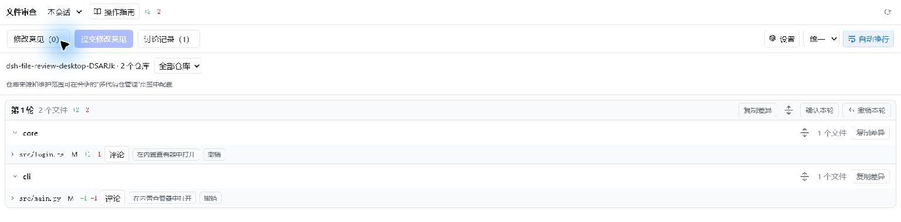

图 1：顶部是范围、评论和阅读设置；下方按轮次、仓库、文件展示会话改动。

## 3. 选择审查范围

点击「文件审查」标题旁的下拉框，按自己想看的内容选择范围。

| 范围 | 显示什么 | 适合什么时候使用 |
| --- | --- | --- |
| 上一轮 | 最近一轮工具产生的文件改动 | 检查 Agent 刚刚修改了什么 |
| 本会话 | 当前会话记录的工具改动，按轮次分组 | 回顾整个会话的修改过程 |
| 待确认 | 当前会话尚未确认的工具改动 | 分轮审查，隐藏已经检查的轮次 |
| 未提交 | 最新提交 HEAD 到当前工作区的差异，包含未跟踪文件 | 查看提交前的全部本地修改 |
| 未暂存 | 暂存区到工作区的差异，包含未跟踪文件 | 查看尚未加入暂存区的修改 |
| 已暂存 | HEAD 到暂存区的差异 | 检查已经暂存、准备提交的内容 |
| 已提交 | 所选提交相对第一父提交的改动 | 回顾某次提交；首次提交以空内容为基线 |
| 分支 | 当前 HEAD 相对所选分支共同祖先的已提交差异 | 检查当前分支累积的提交改动 |

「上一轮／本会话／待确认」来自会话工具记录；手动用编辑器修改的文件，应到 **未提交** 或 **未暂存** 中查看。最近一轮没有文件改动时，「上一轮」会为空，不会自动显示更早一轮。

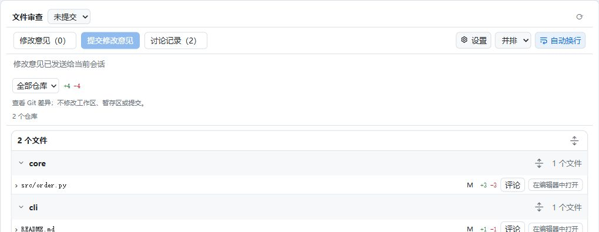

图 2：选择「未提交」后，可以查看工作区修改，并通过「全部仓库」下拉框筛选具体仓库。

查看 **已提交／分支** 时，先选择一个具体仓库，再选择提交或基准分支。「已提交」提供最近 50 次提交；选择全部仓库时，分别查看各仓库的最新提交或自动选择的基准分支。分支比较不包含尚未提交的工作区修改。

Git 范围不会替你执行 `git add`、`git commit` 或切换分支。外部修改、暂存或提交之后，点击 **刷新状态** 重新读取。

## 4. 配置多代码仓项目

### 4.1 添加并保存工程内仓库

1. 进入目标工程的会话，点击会话顶部 **多代码仓管理**。
2. 核对「当前工程目录」。仓库相对路径以这个目录为基准；工程目录和项目名称由会话确定，不能在本页修改。
3. 勾选 **启用多代码仓管理**。需要同时检查工程根目录的文件时，保留 **同时审查项目根目录内的文件**。
4. 点击 **添加仓库**，填写仓库名称和路径。例如工程是 `D:\demo\OrderProject`，两个子仓库可以分别填 `core` 和 `cli`。
5. 也可点击每行的 **打开** 选择已有仓库目录。插件不会创建或克隆仓库。
6. 首次点击 **生成新配置文件**；后续修改点击 **保存配置**。
7. 检查下方识别结果，仓库状态应为 **可用**。回到「文件审查」，即可按仓库分组或筛选。


图 3：工程内的 `core`、`cli` 使用相对路径；仓库名称用于审查列表中的分组。

配置保存在工程根目录的 `dsh-file-review-repositories.json`。配置文件可以随工程保留或提交到 Git。打开工程或其子目录的会话时，插件会自动发现该文件；没有配置文件的工程仍按原有会话目录审查。

### 4.2 工程外仓库与列表维护

- 工程外的仓库使用绝对路径，例如 `D:\SharedRepos\CommonLibrary`，路径框旁显示 **临时**。这类仓库只在当前会话中使用，不写入工程配置文件。
- **删除** 会询问是否从列表移除仓库，不删除磁盘目录。工程内列表修改在保存配置后写入文件。
- 手工修改配置文件后，点击 **重新加载已保存配置**。重新加载会读取保存的内容，未保存的列表编辑应先处理。
- 显示 **路径不存在／不是 Git 根目录** 时，检查是否选中了包含 `.git` 的仓库根目录。
- 如果已有旧仓库清单，页面可能导入供迁移；首次保存后以当前工程配置文件为准。

部分 Desktop 构建的目录选择器不支持起始路径，可能需要 [README 中的目录选择适配](../README.md#desktop-目录选择起始路径适配)。不使用目录选择时，可以直接填写路径。

## 5. 查看差异与展开上下文

### 5.1 展开文件与切换布局

点击文件名前的箭头或文件名，展开／收起该文件差异。点击仓库名称或其左侧箭头，会隐藏／显示整个仓库文件列表。

| 操作入口 | 效果 |
| --- | --- |
| 仓库标题旁的展开／收起图标 | 批量展开／收起该仓库的文件差异，收起后仍保留文件名 |
| 轮次标题旁的图标 | 控制这一轮全部仓库的文件差异 |
| Git 范围「N 个文件」旁的图标 | 控制当前筛选范围的全部文件差异 |
| 顶部「统一／并排」 | 统一布局上下排列旧、新代码；并排布局左侧旧版、右侧新版 |
| 顶部「自动换行」 | 开启后长代码换行；关闭后可横向滚动 |

部分文件已经展开时，批量图标先展开剩余文件，再次点击全部收起。操作只影响当前仓库、轮次或筛选范围。

默认配色下，红色背景与 `−` 表示旧版删除行，绿色背景与 `＋` 表示新版新增行；没有改动标记的是上下文。改为蓝／橙配色后，仍可通过新旧侧、行号和 `＋／−` 判断。

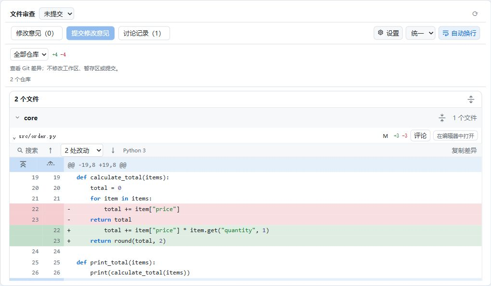

图 4：蓝色条左侧的图标用于展开上下文，行号分别对应旧版和新版。

### 5.2 展开与收起未修改代码

默认保留每处改动附近 3 行上下文，省略较长的未修改部分。把鼠标移到蓝色条中的图标上，可看到完整操作提示。

1. **分批展开**：点击提示为「展开 N 行未修改代码」的按钮。N 默认是 **20**，可在设置中修改；剩余不足 N 行时只展开剩余内容。
2. **一次向上／向下展开**：点击提示为「向上展开全部…」或「向下展开全部…」的双箭头图标。首尾展开至已记录版本的开头或结尾，中间展开至相邻改动块。
3. **收起这一段**：展开后，蓝色条保留 **收起这段已展开的未修改代码** 图标。点击只收起这一处间隔，不影响其他已展开部分。
4. **全部恢复默认上下文**：点击文件差异工具条中的 **收起展开的上下文**。

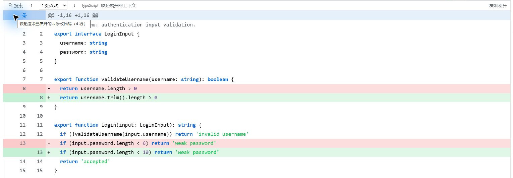

图 5：蓝色条中的收起图标控制这一段；工具条上的文字入口恢复该差异组件的默认上下文。

中间间隔的分批展开会把 N 行分配到两端。Git 历史比较使用所选版本的代码；如果会话历史只记录了局部内容，界面会提示 **历史记录未包含这些代码**，这部分无法展开。

点击 **复制差异** 会复制精简差异，包含改动附近 3 行上下文；不会因为展开了大量未修改代码而把整段都复制进去。需要引用具体代码时，使用第 7 节的选区引用。

## 6. 搜索代码与跳转改动

### 6.1 文件内搜索

1. 展开文件，点击差异工具条上的 **搜索**。
2. 输入要查找的普通文本，例如 `total`。
3. 选择 **新旧版本／旧版／新版**；按需启用 **Aa（区分大小写）**、**整词**。
4. 查看匹配计数，点击搜索框右侧的上下箭头跳转。
5. 点击搜索栏的 **×** 或按 **Esc** 关闭。

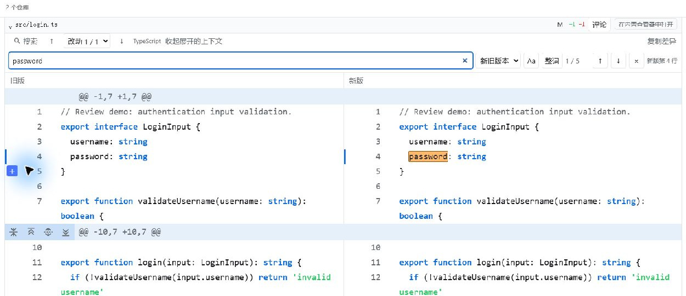

图 6：搜索结果在代码中高亮，右侧显示匹配位置；并排布局可同时对照新旧代码。

搜索包含已记录但折叠的代码，跳转时会展开命中附近的上下文。缺失的历史正文不会从当前磁盘补齐。搜索按字面匹配，不支持正则表达式；新旧共有的上下文在「新旧版本」中只计一次，最多显示前 10,000 处匹配。

### 6.2 跳转改动与快捷键

点击差异工具条中 **上一处改动／下一处改动** 的箭头，或在 **改动 X / Y** 下拉框选择改动块。切换统一／并排布局和语言时，搜索与定位状态会保留。

| 默认快捷键 | 操作 | 生效位置 |
| --- | --- | --- |
| Ctrl/Cmd + F | 打开当前文件搜索 | 当前差异区域获得焦点时 |
| Enter 或 F3 | 下一处匹配 | 文件搜索中 |
| Shift + Enter 或 Shift + F3 | 上一处匹配 | 文件搜索中 |
| Esc | 关闭搜索 | 搜索中；评论编辑器里表示取消编辑 |
| Ctrl/Cmd + ↑／↓ | 上一处／下一处改动 | 当前差异区域获得焦点时 |

文件内搜索和改动导航快捷键可在设置中调整。评论输入框保留自身的编辑快捷键；插件不注册全局快捷键。

## 7. 选择代码与复制引用

### 7.1 单行与连续范围

1. 点击 **行号** 选择一行，而不是点击文件名前的展开箭头。
2. 按住 **Shift**，再点击同一版本侧的另一行号，选中两端之间的连续范围。也可拖选同一侧代码。
3. 并排布局左边是旧版，右边是新版；统一布局也要使用同一侧的实际行号。
4. 在选中的代码或行号上 **右键**，检查菜单顶部的 **新版／旧版 X–Y 行**，确认范围正确。
5. 在菜单选择复制引用、范围评论或外部定位；选择 **清除选区** 取消选择。

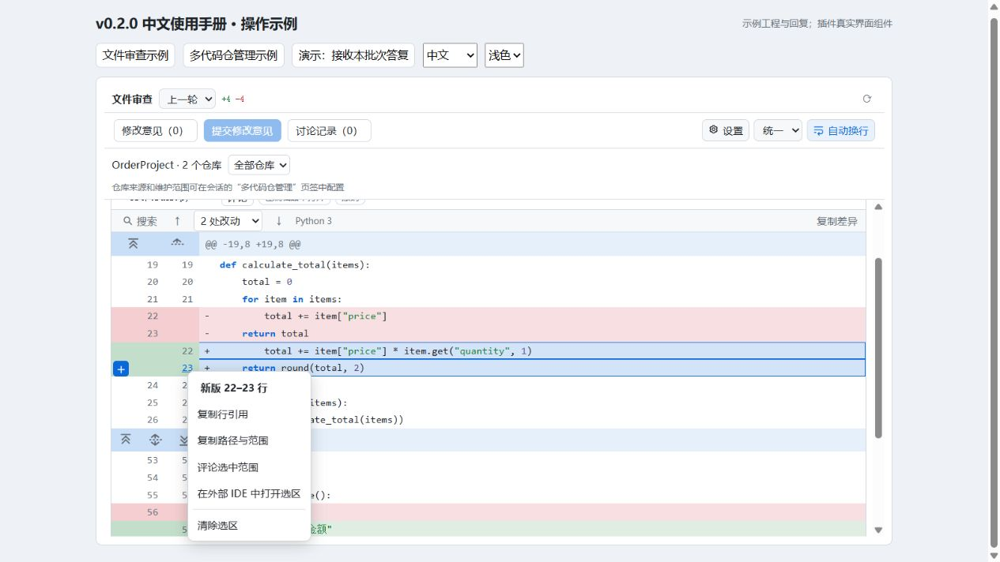

图 7：示例选中新版第 22–23 行。右键菜单列出复制引用、范围评论、外部 IDE 定位和清除选区。

**怎样打开菜单？** 在已选范围内右键会保留整个范围；在范围外的代码或行号上右键，会改为选择该行。没有选区时，直接右键一行也可操作。用键盘聚焦行号后，按 **Shift+F10** 或键盘的菜单键打开，方向键选择、Enter 执行、Esc 关闭。点击菜单外或滚动代码也会关闭菜单。评论输入框仍使用自身的右键菜单。

不能混选旧版与新版，不能跨文件或跨未记录的历史片段。引用正文及相邻上下文各限 64 KiB。切换布局或语言保留选区，切换文件或差异修订后会清除选区。

### 7.2 选择复制方式

| 按钮 | 复制／执行的内容 |
| --- | --- |
| 复制行引用 | 仓库、文件、来源、版本侧、修订、起止行与所选代码，适合粘贴到对话中 |
| 复制路径与范围 | 文件路径及起止行，适合简短说明位置 |
| 评论选中范围 | 在范围起点打开评论编辑器，操作见第 10 节 |
| 在外部 IDE 中打开选区 | 核对磁盘内容后定位新版代码，操作见第 9 节 |
| 清除选区 | 取消当前范围选择 |

复制只写入剪贴板，不覆盖当前对话输入框。复制后可自行粘贴到需要的位置。

## 8. 调整设置与外观

点击文件审查顶部 **设置**。弹窗内容较长时，在弹窗内部向下滚动；底部提供 **恢复默认值／取消／保存**。

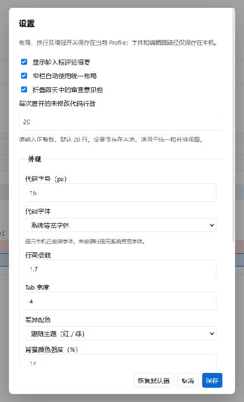

图 8：修改后点击「保存」生效；直接取消或按 Esc 会放弃本次编辑。

| 设置项 | 默认值 | 怎样使用 |
| --- | --- | --- |
| 每次展开的未修改代码行数 | 20 | 填写正整数，决定蓝色条分批展开的行数 |
| 代码字号 | 13 px | 可设为 10–24 px |
| 代码字体 | 系统等宽字体 | 可选 Consolas、Cascadia Code、JetBrains Mono；未安装时使用系统等宽字体 |
| 行高倍数 | 1.7 | 可设为 1.2–2.5，提高后阅读更疏朗 |
| Tab 宽度 | 4 | 可设为 1–8，只改变显示宽度 |
| 差异配色 | 跟随主题（红／绿） | 可切换蓝／橙 |
| 背景颜色强度 | 14% | 可设为 5–40%，调整差异背景深浅 |
| 外部 IDE 程序路径 | 留空 | 自动检测推荐的 VS Code；Antigravity 需要填写完整程序路径 |
| 文件内快捷键 | Ctrl/Cmd + F、Ctrl/Cmd + ↑／↓ | 可更换搜索或改动导航组合 |
| 保存已提交意见与讨论记录 | 开启 | 关闭后新的提交仍发送到会话，但不新增本地讨论批次 |
| 大文件使用虚拟化 | 开启 | 超过 400 行的可见差异块按窗口显示，减少同时渲染的行数 |

设置保存在应用本地，并在打开的审查界面间共用；不改变源文件的字体、缩进或内容。「恢复默认值」先重置弹窗中的值，再点击 **保存** 才应用。

## 9. 在外部编辑器中定位代码

### 9.1 配置外部 IDE

1. 点击 **设置**，向下滚动到 **外部 IDE → 外部 IDE 程序路径**。VS Code 是推荐选项，当前也支持 Antigravity。
2. 使用 VS Code 时可留空自动检测；也可以填写实际安装的 `Code.exe` 完整路径。
3. 使用 Antigravity 时，填写其实际程序路径，例如：

   ```text
   D:\app\Antigravity IDE\Antigravity IDE.exe
   ```

4. 不添加引号、文件路径或启动参数。Windows 支持的程序文件名是 `Code.exe` 或 `Antigravity IDE.exe`，目录按自己的安装位置填写。
5. 点击 **保存**。菜单中的 **在外部 IDE 中打开选区** 启动你配置的程序。不同 IDE 的行定位参数不同，当前适配 VS Code 和 Antigravity，其他 IDE 需要对应的启动适配。

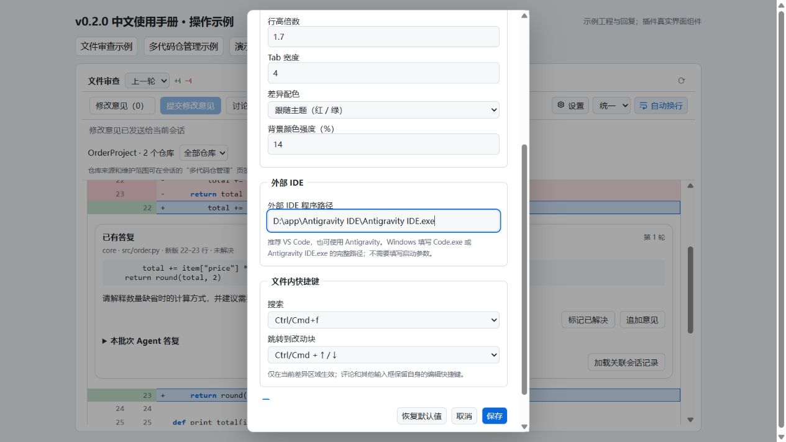

图 9：路径输入框填写可执行文件本身，不填写待打开的代码文件。

### 9.2 打开并核对行号

1. 保存编辑器中对代码文件的修改。
2. 在插件中选择 **未提交** 或 **未暂存**，点击 **刷新状态**。
3. 展开目标文件，点击 **新版行号** 选择一行；选择多行时使用同一侧的 Shift+点击。
4. 在所选代码或行号上 **右键**，选择 **在外部 IDE 中打开选区**。
5. 编辑器打开对应文件后，查看光标所在位置及底部行号。选中范围时定位到第一行，不会自动选中整个范围。

插件打开前会检查文件与引用是否匹配。结果显示在右键菜单中；如果唯一匹配的位置已经移动，提示 **引用在当前文件中位于第 N 行**，点击 **定位到第 N 行** 确认后再打开。

**两个编辑器入口的区别：** 文件标题旁的 **在内置查看器中打开** 使用宿主的内置查看器打开文件；右键菜单的 **在外部 IDE 中打开选区** 使用配置的外部程序并传递核对后的行号。

### 9.3 不能定位时怎么办

| 提示／现象 | 处理方式 |
| --- | --- |
| 未找到有效的外部 IDE | 检查程序路径、文件名与实际安装位置；Antigravity 不会通过留空自动检测 |
| 旧版代码不能直接当作当前文件行号 | 选择新版行，或在插件中阅读旧版历史差异 |
| 当前文件已变化，找不到一致引用 | 保存磁盘文件、刷新差异后重新选择；也可打开文件自行查看 |
| 引用存在重复匹配 | 当前内容不能唯一确定位置，使用内置文件入口自行查看 |
| 文件已不存在 | 阅读插件中的历史差异，不能打开已删除文件 |
| 提示已发送，但窗口没有出现在前面 | 检查已打开的编辑器窗口或任务栏；发送成功不保证窗口获得焦点 |
| 打开后内容或行号不一致 | 检查编辑器是否有未保存的缓冲区，插件核对的是磁盘内容 |

暂存、提交、分支或旧轮次中的新版代码也需要匹配当前磁盘内容。支持定位仓库范围内的普通 UTF-8 文本，文件不超过 16 MiB；无法核对的引用不会使用猜测行号。

## 10. 添加与提交修改意见

### 10.1 三种评论入口

| 评论对象 | 操作 |
| --- | --- |
| 单行 | 鼠标移到代码行左侧，点击出现的 **＋** |
| 连续范围 | 选择同一侧的起止行，在选中代码或行号上右键，选择 **评论选中范围** |
| 整个文件 | 点击文件标题旁的 **评论**，适合提出整体问题或评论无法显示文本差异的文件 |

在评论框输入意见，然后点击 **评论**；编辑已有意见时按钮为 **保存评论**。也可按 **Ctrl/Cmd + Enter** 保存，点击 **取消** 或按 **Esc** 放弃正在编辑的内容。

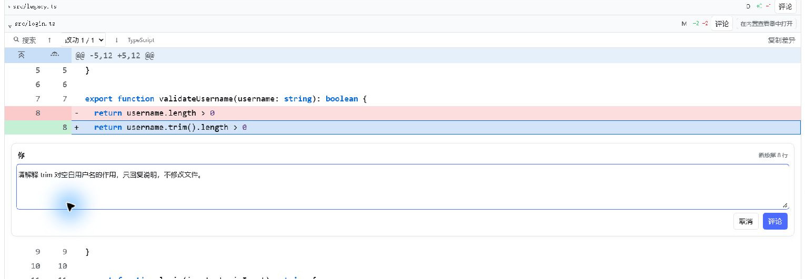

图 10：意见引用新版第 22–23 行；点击「评论」后只保存草稿，尚未发送。

### 10.2 汇总检查并提交

1. 保存评论后，顶部 **修改意见（N）** 的数量增加，代码范围起点显示待提交卡片。
2. 点击 **修改意见（N）** 查看本会话全部待提交意见，包括其他文件和审查范围的意见。
3. 按需 **编辑／删除**；还有正在编辑的评论时，先保存或取消。
4. 点击 **提交修改意见**，全部待提交意见汇总为一条消息发给当前会话的 Agent。
5. Agent 忙碌时消息会排队。提交成功后清除本批草稿；默认在「讨论记录」中保留提交内容。

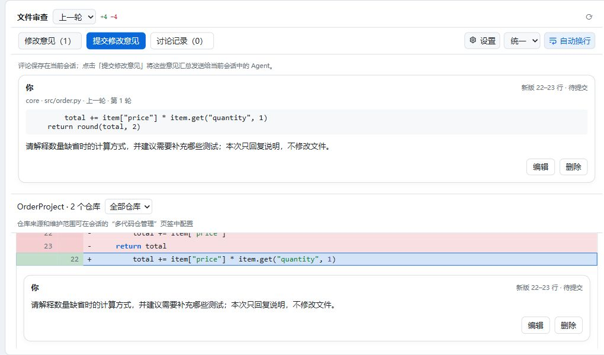

图 11：提交前可以再次核对仓库、文件、来源、行范围和意见内容。

**保存评论、提交修改意见、Git 提交是三个不同操作。** 保存评论只保存本地草稿；提交修改意见会向 Agent 发送消息，Agent 可能依据意见修改工程；两者都不执行 `git commit`。发送时不会覆盖对话输入框中已有的草稿。

提交失败时保留待提交意见。若讨论状态显示 **提交结果待核对**，先检查会话和排队消息，确认没有成功发送后再决定是否重试，避免重复提交。

### 10.3 代码变化后的草稿

差异修订变化后，旧评论保留原始引用并提示 **差异已变化**，不会自动挪到另一个行号。

来自 **未提交／未暂存** 的新版过期草稿，可点击 **核对当前位置**。找到唯一匹配且当前差异也对应时，点击 **将草稿引用更新到第 N 行** 明确确认。历史来源和已经提交的意见保留原始位置。

## 11. 阅读与管理讨论记录

点击顶部 **讨论记录（N）**，查看已提交批次。记录包含提交意见、参考代码、状态与关联的 Agent 文字答复。

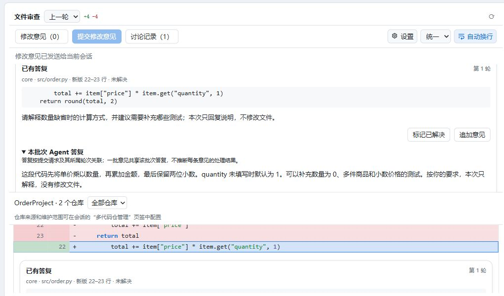

图 12：展开「本批次 Agent 答复」阅读答复；检查实际结果后，可手动标记已解决。

| 状态／按钮 | 含义与操作 |
| --- | --- |
| 已提交，等待入轮 | 消息已经提交，等待进入实际处理轮次 |
| 处理中／已有答复 | Agent 正在处理，或已记录关联文字答复 |
| 本轮结束，未记录文字答复 | 关联轮次结束，但没有记录文字答案；到会话中查看实际执行结果 |
| 已取消／提交失败 | 查看会话与草稿，决定是否重新提出意见 |
| 提交结果待核对 | 发送结果不确定，先核对会话；重启不会自动重发 |
| 新回复／标记已读 | 有尚未阅读的答复；展开答复也会标记为已读 |
| 标记已解决／重新打开 | 手动维护单条意见的解决状态，不修改代码或 Git 状态 |
| 追加意见 | 生成带原批次上下文的新草稿，编辑保存后仍需点击「提交修改意见」 |
| 加载关联会话记录 | 请求加载关联的会话历史；不保证自动跳转到聊天中的对应位置 |

答复按提交请求及实际轮次关联。一批意见共享该批次答复，插件不会判断每条意见是否真的修复；请检查代码和验证结果，再标记已解决。若宿主缺少请求身份接口，答复只能在会话中查看。

## 12. 确认轮次、撤销与重新应用

### 12.1 确认已经检查的轮次

1. 选择 **待确认**，展开并检查某一轮的文件。
2. 该轮结束后，点击轮次标题中的 **确认本轮**。
3. 该轮从「待确认」范围隐藏；在「本会话／上一轮」仍可看到 **已确认** 标记。
4. 需要重新检查时，在「本会话／上一轮」点击 **取消确认**，放回待确认列表。

确认按整轮生效，包含该轮全部仓库；正在进行的轮次不能确认。同一轮后来补充了新的改动时，会重新变为待确认。确认只维护审查进度，不改代码、不清空评论，也不是 Git 提交。

### 12.2 撤销与重新应用

在 **上一轮／本会话／待确认** 中，对支持还原的文件点击 **撤销**，或在轮次标题点击 **撤销本轮**。撤销成功后显示 **已撤销**，按钮变为 **重新应用** 或 **重新应用本轮**。

这些按钮会执行文件还原操作。插件会核对当前内容；出现 **内容冲突／不可还原** 时，不会强行覆盖。新建、删除或缺少可还原记录的文件可能不支持操作；批量结果若提示部分失败，应逐个检查状态。Git 范围没有这类撤销按钮。

## 13. 长会话、大文件与特殊文件

- **较早轮次**：本会话主列表保留最近 5 轮，进行中的轮次始终保留。底部点击 **已归档 N 轮** 查看更早内容，每次 **加载更多** 追加 10 轮。这里的归档只是列表折叠，不删除记录。「待确认」中的较早轮次直接分页显示。
- **大文件**：超过 400 行的可见差异块默认使用内部滚动区域，只显示附近的行。滚动、搜索、改动导航和复制仍基于完整已记录内容；设置中可关闭虚拟化。
- **语言高亮**：按扩展名自动识别 C/C++、JavaScript、TypeScript、Python 3、JSON、Markdown。未知类型显示纯文本，Markdown 显示源码。高亮是基础词法着色，极长内容可能回退为纯文本。
- **新增／删除／重命名文件**：Git 范围按相应状态显示。重命名显示旧路径到新路径；删除文件可阅读已有历史差异，但不能在磁盘打开。
- **二进制等特殊文件**：二进制、符号链接或超出读取限制的文件显示说明，仍可添加整文件评论。超过 2 MiB 的未跟踪文件不显示完整文本差异。
- **会话里的终端删除**：能识别记录中的字面路径删除命令，文件会标为「已删除」；没有内容时无法显示差异或撤销。通配符、命令替换等不能可靠识别的删除，应在 Git 范围核对。
- **Code Mode／PTC**：能捕获实际记录的 edit／write 子调用并显示对应差异，阅读操作与其他会话差异相同。
- **窄侧栏**：工具条和轮次标题会换行，部分次要按钮可能隐藏。需要查看完整操作时，可以适当加宽侧栏。

## 14. 语言与数据保存

在宿主 **设置 → 通用设置 → 语言** 选择中文或 English，插件的文件审查、多代码仓管理、设置、评论和审查行跟随切换。代码、路径、用户输入的评论保持原文；切换语言会保留展开状态、选区和正在编辑的内容。

| 数据 | 保存位置与范围 |
| --- | --- |
| 工程内仓库配置 | 工程根目录的 `dsh-file-review-repositories.json` |
| 工程外临时仓库 | 当前会话的临时配置，不写入上述文件 |
| 布局、换行、阅读设置、编辑器路径 | 应用本地存储，在审查界面间共用 |
| 待提交意见、已提交讨论、轮次确认 | 应用本地存储，按会话隔离 |

这些本地记录不会自动成为 Git 里的审查记录，也不会自动在其他设备间同步。看到存储不可用提示时，当前窗口仍保留可用数据，但关闭应用可能丢失；重要意见可以先复制保存。

## 15. 常见问题

| 问题 | 检查方法 |
| --- | --- |
| 找不到「文件审查」 | 检查本插件是否启用，在原生右侧栏「＋」引导页中打开；安装更新后完全重启宿主 |
| 「操作指南」打不开 | 安装更新后完全退出 Desktop（包括托盘）并重启；检查本插件是否启用，以及安装包中是否包含手册 |
| 手册只显示截图说明，没有图片 | 完全退出 Desktop（包括托盘）并重启，再点击文件审查顶部的「操作指南」；在插件弹窗中查看截图，点击截图可放大 |
| 手动修改了代码却看不到 | 先保存文件，选择「未提交／未暂存」并刷新；「上一轮」只看会话工具改动 |
| 「上一轮」为空，但本地有修改 | 最近一轮可能没改文件；改用「本会话」回顾工具记录，或「未提交」看磁盘修改 |
| 多仓库没有出现 | 检查当前会话所属工程、配置文件是否生成、仓库是否启用以及识别状态 |
| 仓库选好后保存按钮不可点 | 已有配置且没有新的列表修改时，保存按钮不可用；编辑后再保存 |
| 历史上下文无法展开 | 当时的会话记录没有包含这些代码；查看 Git 历史比较或当前文件，不会自动替换历史正文 |
| 选中了代码，却找不到「评论选中范围」 | 在蓝色选区的代码或行号上右键，选择「评论选中范围」；也可聚焦行号后按 Shift+F10 |
| 找不到外部打开按钮 | 在新版代码或行号上右键，选择「在外部 IDE 中打开选区」。文件标题的按钮是内置查看器入口 |
| 评论保存后 Agent 没回应 | 「评论」只保存草稿，还需点击顶部「提交修改意见」；忙碌时检查排队状态 |
| 顶部提交按钮不可点 | 检查有没有待提交意见、正在发送，或尚未保存／取消的评论编辑器 |
| 标记已解决后代码没变化 | 该按钮只记录审查状态；实际修改需提交意见并核对 Agent 的执行结果 |
| 行号与当前文件不同 | 所看的可能是旧版、暂存或历史版本；外部定位会另外核对当前磁盘内容 |
| 撤销不可用或出现冲突 | 当前内容或历史记录不支持安全还原，先核对文件，不要把确认轮次当作撤销 |

## 16. 截图文件索引

截图统一存放在本手册旁的 **image** 目录，使用 **两位顺序编号 + 功能名称 + `.jpg`** 命名。编号按正文中的操作顺序排列；更新截图时尽量保留文件名，使链接继续可用。

| 文件名 | 展示内容 |
| --- | --- |
| `01-file-review-overview.jpg` | 会话文件审查总览 |
| `02-git-review-scope.jpg` | 未提交范围与仓库筛选 |
| `03-multi-repository-settings.jpg` | 多代码仓配置 |
| `04-unified-diff-context-controls.jpg` | 统一差异与上下文展开入口 |
| `05-expanded-context-collapse.jpg` | 展开后的局部／整体收起入口 |
| `06-split-diff-search.jpg` | 并排差异中的搜索 |
| `07-line-selection-context-menu.jpg` | 范围选择与右键操作菜单 |
| `08-diff-appearance-settings.jpg` | 展开行数与外观设置 |
| `09-external-editor-settings.jpg` | 外部编辑器路径与其他设置 |
| `10-range-comment-editor.jpg` | 范围评论编辑 |
| `11-pending-review-comments.jpg` | 待提交意见汇总 |
| `12-review-discussion-history.jpg` | 已提交讨论与关联答复 |
